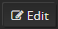

# Administration Settings

1.  The home dashboard shows up. You can find the current values of the
    opvizor PerfAnalyzer backend itself (CPU, RAM, HD, system load)
2.  Configure your organization - click on " **Admin**" in the menu on
    the left, and then select "**Global Orgs**".   
                                                                  
        
3.  Click the **Edit** button to
    enter your organization's name.  
    
4.  Enter your organizations name in the **Name** field.  
      
      
5.  Save your changes by clicking on **Update**.
6.  Configure your email address. Click on **Admin** \> **Global
    Users.  
    **  
    The Users dialog appears.  
    
7.  Edit the account of the admin user by
    clicking **Edit** in the
    user list.  
    The Edit User dialog appears.  
     
8.  Type the email address in the **Email** field.
9.  Save your changes by clicking on **Update**.

