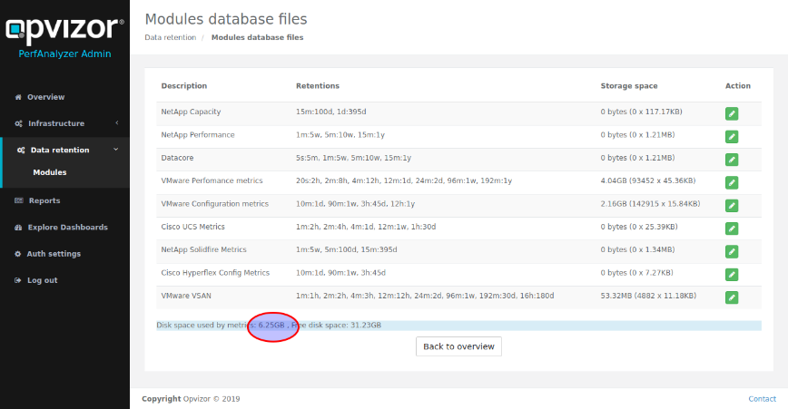
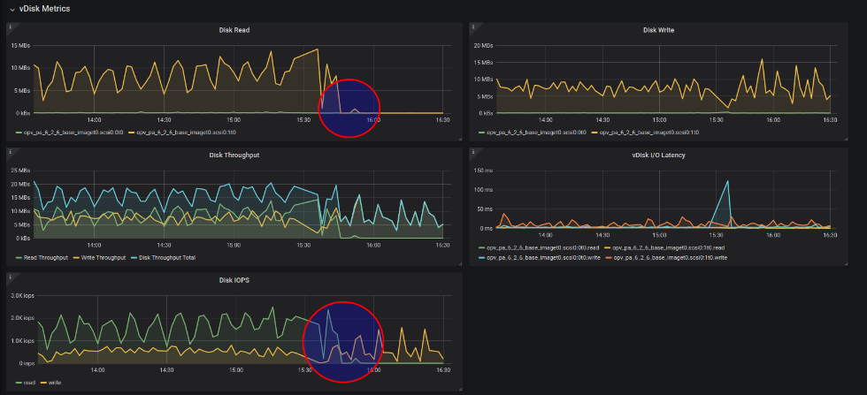

# FAQ

## Problem

**I don't see recent data but data from some hours ago.**

### Reason

That´s a very common sign of a wrong time of the Performance analyzer
appliance. That also means that the ESXi host time the appliance runs on
is wrong.

### Solution

The Performance Analyzer appliance contains and runs VMware Tools
configured for time synchronization with the ESXi host.

Therefore, a wrong time of the appliance is a typical sign of a wrong
time on the ESXi host. Please check your ESXi hosts time and NTP
settings and adjust it. It makes sense to restart the Performance
Analyzer appliance.

## Problem

**There is no new data in the dashboards anymore and most charts are
empty**

### Reason

Disk Space is full

### Solution

  
If the ***system*** partition is close or at 100% please let increase
the size of the ***first*** virtual disk of the Performance Analyzer
appliance. There is no need to shutdown the appliance, as we auto-resize
the partition within 5 minutes.

If the ***data*** partition is close or at 100% please let increase the
size of the ***second*** virtual disk of the Performance Analyzer
appliance. There is no need to shutdown the appliance, as we auto-resize
the partition within 5 minutes.

  

## Problem

**VMware dashboards suddenly stop to show new data**

### Reason

VMware vCenter user credentials have changed

### Solution

  
Please check if the vCenter connection is still working (Admin Web
Interface / <http://appliance-ip/admin)> and a green state including the
number of ESXi hosts is shown. You can click the **test** button to
re-test the connection. Use the edit button to set the new password.

If the vCenter has been renamed, you can change that the same way

## Problem

**random gaps in graphs, lasting between 5 minutes and several hours**

### Reason

There are three main causes, which can be responsible for the problem:

  - Generally too slow storage - Opvizor recommends to use only flash
    storage
  - Noisy neighbors imposing high load to the storage at random time
  - To few main memory to handle the size of your infrastructure

The gaps are the result of the appliances automatic mitigation for this
situation: Whenever the timeseries databases get unresponsive due to too
much outstanding IOPS, they will be restarted, purging the unhandled
transactions.

### Solution

You can improve the situation either by moving the appliance to faster
storage, reduce noisy neighbors or increase the appliance memory to have
the time series databases in the OS disk cache.

Some words on the latter: Since retention data is calculated before
writing metrics to disk, the time series databases need to do a lot of
reads, to gather all data for updating the samples in the higher
retentions. As long as the OS cache is big enough, these IO won't hit
the storage, so there is only the write IO, which will go to storage.

But when the OS disk cache is even slightly smaller than the time series
database working set, the cache will get continuously revolved on each
crawler run. So in case you suffer from that continuous revolving, you
should increase the appliances memory, until the OS disk cache is big
enough.

Some hints for sizing the appliance memory and observing the IOPS:

  - Open the dashboard "VMware Performance: VM", select 3 hour interval,
    and choose your Performance Analyzer VM. Then scroll down and open
    the row "vDisk Metrics". If there are more Read IOPS then Write IOPS
    you should try the following procedure:  
      
  - Determine the time series database footprint:  
      
      
  - in this example, we have a footprint of 6.25 GB for the raw metrics.
    Since there are also other databases for meta-data and OS-metrics, a
    good starting point for sizing memory would be to almost double that
    amount - so in this example we would start at 12 GB main memory.
  - After changing the memory size and rebooting, give the appliance
    about 45 minutes, before doing the following check:
  - Open the dashboard "VMware Performance: VM", select 3 hour interval
    and choose your Performance Analyzer VM. Scroll down and open the
    row "vDisk Metrics":  
      
      
      
      
    In this example you see an appliance which got memory doubled at
    15:30 and was powercyled for that. Everything before 15:30 shows the
    appliance running with to few memory, leading to continuous cache
    revolving and lots of disk reads. After 15:30 the cache is big
    enough. It fills within about 15 minutes after reboot, then read IO
    drops nearly to zero.  
      
    When the main memory is chosen big enough, you will see almost no
    Disk Reads. Also read IOPS will almost vanish. Disk Write and Write
    IOs will be swinging more, with a slight increase of the mean value.
    This is because of the much eager write back performance, so the
    likelihood for a block to be written several times in the cache
    before eventually getting written to disk sinks. However, overall
    you should see a massive reduction of the IO footprint, when main
    memory is big enough.

  

  

  

  

  

  

  

  

  

## Attachments:

[image2017-7-5\_23-12-2.png](attachments/212172801/212172804.png)
(image/png)  

[image2017-6-28\_22-4-35.png](attachments/212172801/212172807.png)
(image/png)  

[worddavac0142df730012f5f4afb8f014e9c2fe.png](attachments/212172801/212172810.png)
(image/png)  

[image2018-7-12\_9-6-47.png](attachments/212172801/765263903.png)
(image/png)  

[image2018-7-12\_9-10-59.png](attachments/212172801/765263907.png)
(image/png)  

[image2020-3-3\_16-10-18.png](attachments/212172801/1079803905.png)
(image/png)  

[image2020-3-3\_16-17-39.png](attachments/212172801/1079574547.png)
(image/png)  

[image2020-3-3\_16-17-58.png](attachments/212172801/1079640086.png)
(image/png)  

