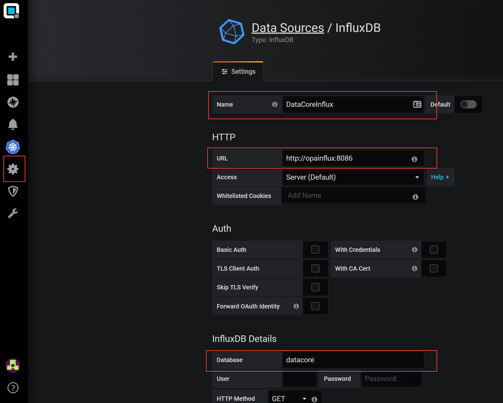

# Integration DataCore SANSymphony

# Installation Performance Analyzer DataCore SANSymphony v.6.x

  

## DataCore SANSymphony Server

  

### Configure the Metrics Export

Open the **SANsymphony-V Performance Monitor Configuration** program.
Make sure you see the same screen as shown below, as there are 2
different Performance Monitor Tools.  

You can find a more detailed guideline by DataCore, how to work with
Performance Monitor
Configuration: <http://datacore.custhelp.com/app/answers/detail/a_id/1676>

  
Add the following counters to be exported:  
  

**Category**: DataCore Servers

**Instances**: All Instances

**Counters**:

  - "Cache Size"
  - "Cache Read Hits / sec"
  - "Cache Read Misses / sec"
  - "Cache Write Hits / sec"
  - "Cache Write Misses / sec"
  - "Total Reads / sec"
  - "Total Writes / sec"
  - "Cache Read Hit Bytes / sec"
  - "Cache Read Miss Bytes / sec"
  - "Cache Write Hit Bytes / sec"
  - "Cache Write Miss Bytes / sec"
  - "Free Cache"
  - "Total Bytes Transferred / sec"
  - "Total Bytes Read / sec"
  - "Total Bytes Written / sec"
  - "Total Operations / sec"
  - "% Free Space for Replication Buffer"

  

**Category**: DataCore Server SCSI ports

**Instances**: All Instances

**Counters**:

  - Average Time / Target Read
  - Average Time / Target Write
  - Target Operations / sec
  - Target Reads / sec
  - Target Writes / sec
  - Target Bytes Transferred / sec
  - Target Bytes Read / sec
  - Target Bytes Written / sec
  - Pending Target Commands
  - Average Time / Initiator Read
  - Average Time / Initiator Write
  - Initiator Operations / sec
  - Initiator Reads / sec
  - Initiator Writes / sec
  - Initiator Bytes Transferred / sec
  - Initiator Bytes Read / sec
  - Initiator Bytes Written / sec
  - Pending Initiator Commands

  

**Category**: DataCore Disk pools

**Instances**: All Instances

**Counters**:

  - % Allocated
  - % Available
  - Bytes Allocated
  - Bytes Available
  - Average Time / Read
  - Average Time / Write
  - Total Operations / sec
  - Total Bytes Transferred / sec
  - Total Bytes Read / sec
  - Total Bytes Written / sec

  

**Category**: DataCore Physical Disk

**Instances**: All Instances

**Counters**:

  - Average Time / Read
  - Average Time / Write
  - Total Bytes Transferred / sec
  - Total Bytes Read / sec
  - Total Bytes Written / sec
  - Total Pending Commands

  

**Category**: DataCore Virtual Disks

**Instances**: All Instances

**Counters**:

  - Bytes Out Of Affinity
  - Total Bytes Transferred / sec
  - Total Operations / sec

  
Close SANsymphony-V Performance Monitor Configuration program after the
change\!

### Download and Install the DataCollection Service

  
Download Link – opvizor-datacore Datensammler:
<https://storage.googleapis.com/opvizor/Datacore/opvizor-datacore.zip>  
**Unblock the archive\! Please make sure to unblock the downloaded
archive:**  
  
**Unzip the** **content of opvizor-datacore zip file to a directory you
want the application to run from, our recommendation is C:\\Program
Files\\telegraf**  
Now you need to change the string *pa\_appliance\_ip* in the
telegraf.conf file *urls = \["http://*pa\_appliance\_ip*:8086"\]* to the
IP address or network name of the Performance analyzer virtual
appliance.  
**Open a Windows Command Line or PowerShell Session having
administrative rights**  
  
**Run the following command:**  
"C:\\Program Files\\Telegraf\\telegraf.exe" --config "C:\\Program
Files\\Telegraf\\telegraf.conf" --config-directory "C:\\Program
Files\\Telegraf\\telegraf.d" --service install  
That installs the Data collection service and it collects the MS Windows
data of the server as well as the datacore data.  
**If you want to collect Windows data from the other Datacore hosts in
the cluster as well, please install telegraf as well, but delete the
"C:\\Program Files\\Telegraf\\telegraf.d" folder\!**

**To manage the telegraf data collector:**

net stop telegraf

net start telegraf

## Virtual Appliance

**Create a new data source**

Add the Datacore data source named **DataCoreInflux**:  
  
  
Click Save & Test.  
Now, you need to import the DataCore Dashboard json file that can be
found
here:  
<https://storage.googleapis.com/opvizor/Datacore/DataCore%20SANSymphony%20Influx-1524149879665.json>  
  
When importing the dashboard please select DataCoreInflux as the Influx
datasource.

## Summary

After a couple of minutes, you should see the first data within your
DataCore SANSymphony Dashboard.  
If you want to uninstall the service for any reason, you can do so by
running telegraf --service uninstall within the installation directory
as an administrator.

## Attachments:

[worddav9c33d0c9ce1b428a29ba9d83fce74029.png](attachments/82057165/82057164.png)
(image/png)  

[worddavf6d8b31700c876ec71f764635724a9c1.png](attachments/82057165/82057172.png)
(image/png)  

[worddavda248ae6f3de40e960d85e7e8885cba1.png](attachments/82057165/82057178.png)
(image/png)  

[worddave69fc6a73bb33623489a1a59338d777b.png](attachments/82057165/82057184.png)
(image/png)  

[worddav4f3f832c99c2e71176046f949a9999dd.png](attachments/82057165/82057190.png)
(image/png)  

[worddavd3d2cd515ea5890a25fcc4d08c6e0a48.png](attachments/82057165/793116673.png)
(image/png)  

[worddavee4e32ae0e2a5ca86319aafe91dcdde5.png](attachments/82057165/793116679.png)
(image/png)  

[worddavf043564b5444f7f9eb89543962ae6e93.png](attachments/82057165/793116685.png)
(image/png)  

[image2020-2-12\_14-52-16.png](attachments/82057165/1034092551.png)
(image/png)  

[image2020-2-12\_14-53-21.png](attachments/82057165/1034092559.png)
(image/png)  

