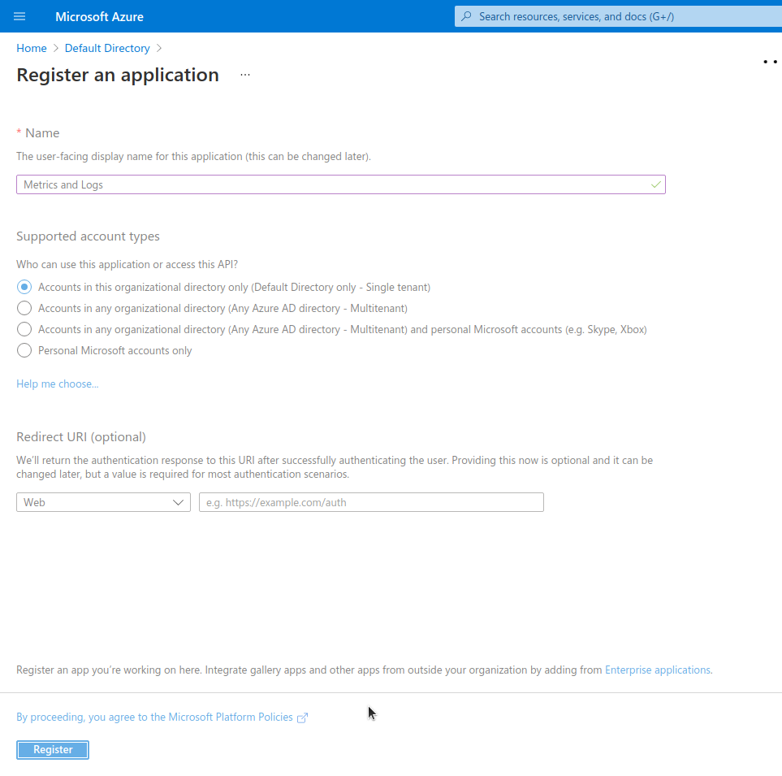

# Integration Microsoft Azure

## create an app registration

1. Open Azure Portal, proceed to Azure Active Directory.  
2. In the menu on the left, select "App registrations".  
3. In the navigation bar on the top of App registrations page, select "+ New registration".  
4. In the "Register an application" page, enter a name for the app - e.g. *Metrics and Logs*. For supported account type, you can stay with the default, the optional Redirect URI can stay empty.  
  
  
5. After creation, Azure will show you the new App registration entry. Copy the Application (Client) ID and the Directory (tenant) ID. Create a client secret with the "Client credentials" link.  
  
  

## assign reader role to app registration
1. Proceed to your subscription (in case you use management groups, go instead to your tenant root group).  
2. Select "Access control (IAM)".  
3. Select "Add role assignment".  
4. On the Add role assignment page, select the "Reader" role and add your App registration to that role.  
5. Press "Review + assign" to make your change.  
  
  
