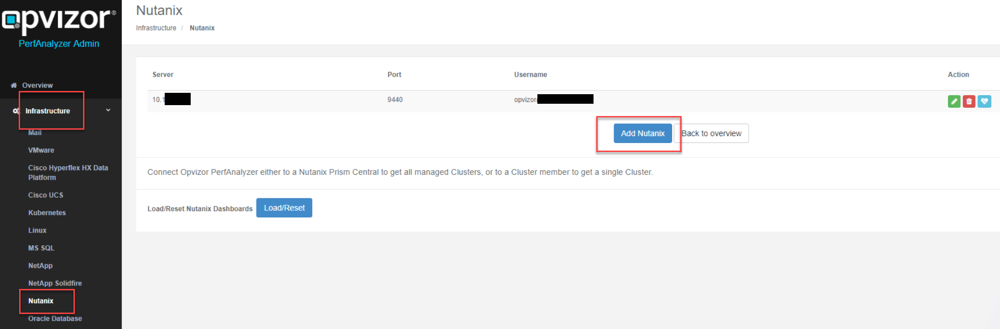
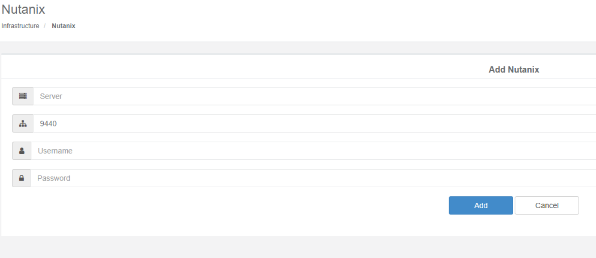
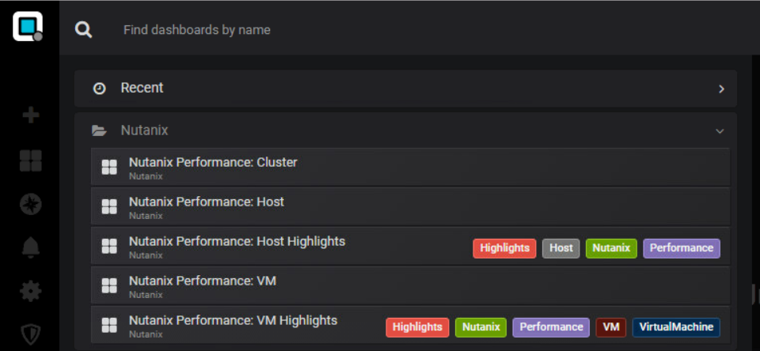
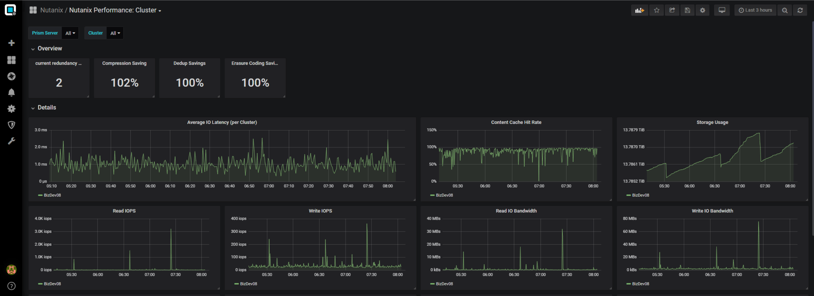
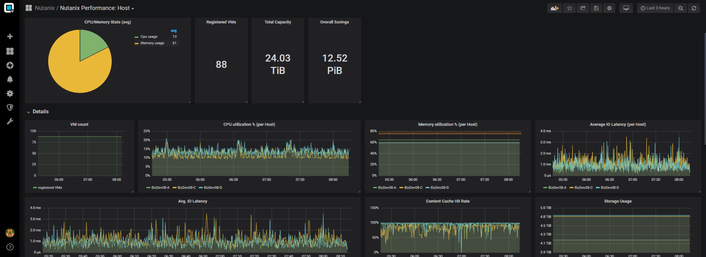
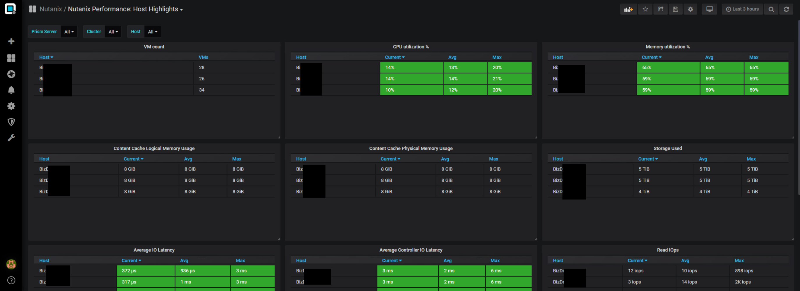
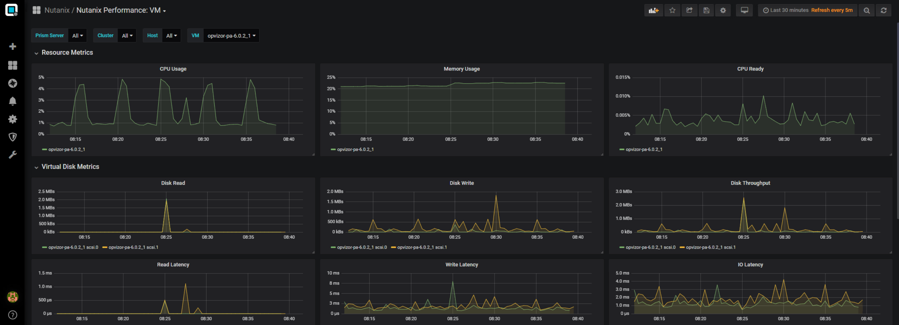
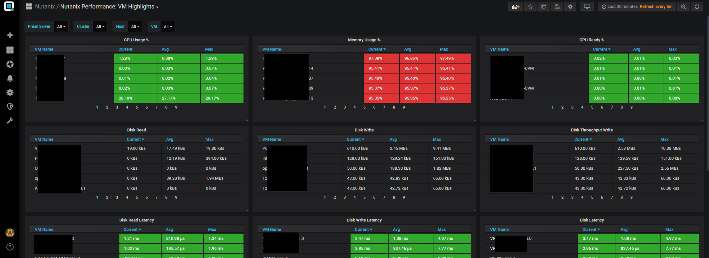

# Integration Nutanix Prism Central

#   
License

**Please contact** [**sales@opvizor.com**](mailto:sales@opvizor.com)
**to receive information about**

  - Performance Analyzer Nutanix Feature Pack. The extension is
    automatically available during the trial.

  - Performance Analyzer appliance qcow2 disk format.

# Add your Nutanix environment

You can add the system or systems under Infrastructure → Nutanix

Please make sure to use a Prism Central (or Elements) **user** with
**view
permissions**\!

<https://portal.nutanix.com/#/page/docs/details?targetId=Prism-Central-Guide-Prism-v56:ssp-ssp-built-in-roles-pc-r.html>

You should see the first data within the dashboards within 5-10 minutes.

# Dashboards

You can start by either searching for Nutanix in the dashboard
navigation or selecting the Nutanix
Folder:

## Cluster View

### Metrics:

  - currentRedundancyFactor

  - data\_reduction.compression.saving\_ratio\_ppm

  - data\_reduction.dedup.saving\_ratio\_ppm

  - data\_reduction.erasure\_coding.saving\_ratio\_ppm

  - avg\_io\_latency\_usecs

  - content\_cache\_hit\_ppm

  - storage.usage\_bytes

  - num\_read\_iops

  - num\_write\_iops

  - read\_io\_bandwidth\_kBps

  - write\_io\_bandwidth\_kBps

  - content\_cache\_logical\_memory\_usage\_bytes

  - content\_cache\_logical\_ssd\_usage\_bytes

  - content\_cache\_physical\_memory\_usage\_bytes

  - content\_cache\_physical\_ssd\_usage\_bytes

## Host View and Host Highlights

### Metrics:

  - hypervisor\_cpu\_usage\_ppm

  - hypervisor\_memory\_usage\_ppm

  - maxCapacity

  - data\_reduction.overall.user\_saved\_bytes

  - numVMs

  - avg\_io\_latency\_usecs

  - content\_cache\_hit\_ppm

  - storage.usage\_bytes

  - num\_read\_iops

  - num\_write\_iops

  - read\_io\_bandwidth\_kBps

  - write\_io\_bandwidth\_kBps

  - hypervisor\_avg\_read\_io\_latency\_usecs

  - hypervisor\_avg\_write\_io\_latency\_usecs

  - hypervisor\_num\_read\_iops

  - hypervisor\_num\_write\_iops

  - content\_cache\_logical\_memory\_usage\_bytes

  - content\_cache\_logical\_ssd\_usage\_bytes

  - content\_cache\_physical\_memory\_usage\_bytes

  - content\_cache\_physical\_ssd\_usage\_bytes

## Virtual Machine View and VM Highlights

### Metrics

  - numVCpus

  - memoryCapacityInBytes

  - memoryReservedCapacityInBytes

  - cpuReservedInHz

  - numNetworkAdapters

  - numDisks

  - hypervisor\_cpu\_usage\_ppm

  - memory\_usage\_ppm

  - hypervisor.cpu\_ready\_time\_ppm

  - controller\_read\_io\_bandwidth\_kBps

  - controller\_write\_io\_bandwidth\_kBps

  - controller\_io\_bandwidth\_kBps

  - controller\_avg\_read\_io\_latency\_usecs

  - controller\_avg\_write\_io\_latency\_usecs

  - controller\_avg\_io\_latency\_usecs

  - controller\_num\_read\_iops

  - controller\_num\_write\_iops

  - controller\_num\_iops

  
