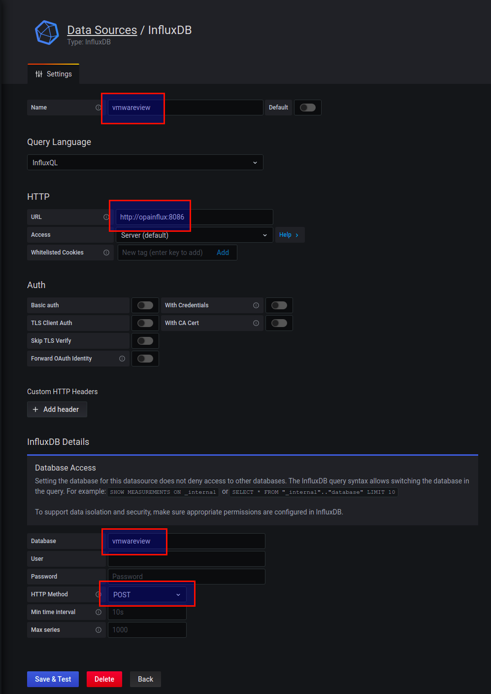

# Integration VMware Horizon View

To enable VMware Horizon View, please install the telegraf service on
each VMware View VM you want to monitor (*after the eval, it makes sense
to integrate it into the master image and change the collection interval
(when monitoring more than 200 VMs) to 60seconds instead of the 10second
default*) using the following archive:

<https://opvizor-perfanalyzer.s3-eu-west-1.amazonaws.com/latest/telegraf_view.zip>

  

Please make sure to unblock the downloaded file before extracting into
%programfiles%

Change the following line within %programfiles%\\telegraf\\telegraf.conf
to match your Performance Analyzer appliance IP or FQDN:

\[\[outputs.influxdb\]\]

urls =
\["[https://**pa\_appliance\_ip**:8086](http://pa_appliance_ip:8086)"\]

  

**Open a administrative command line and run:**

*%programfiles%\\telegraf\\telegraf\_installservice.cmd*

*net start telegraf*

**Add a new datasource to Performance Analyzer**

Please select vmwareview as a datasource when importing:

[VMware Horizon Desktop VM](attachments/810450945/810614792.json)

[Highlights: VMware Horizon View](attachments/810450945/1289060353.json)

