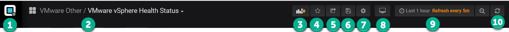

# Navigating Performance Analyzer

Performance Analyzer uses a similar global and local navigation layout
to the [Grafana open source project](https://grafana.com/).

<table>
<thead>
<tr class="header">
<th>Item</th>
<th>Name</th>
<th>Description</th>
</tr>
</thead>
<tbody>
<tr class="odd">
<td>1</td>
<td>Additional Navigation</td>
<td>

Additional Navigation for key functions:

<ul>
<li>Admin</li>
<li>Dashboards</li>
<li>Alerting</li>
<li>Data Sources</li>
<li>Plugins</li>
<li>Admin</li>
<li>Pin 
 
</li>
</ul>

</td>
</tr>
<tr class="even">
<td>2</td>
<td>Current Local Navigation</td>
<td>

The current left navigation item selected from the Additional Navigation button.

</td>
</tr>
<tr class="odd">
<td>3</td>
<td>Add Panel</td>
<td>Add a new panel to the current dashboard</td>
</tr>
<tr class="even">
<td>4</td>
<td>Favorites (Star)</td>
<td>Adds the current screen to your Favorites list.</td>
</tr>
<tr class="odd">
<td>5</td>
<td>Share Dashboard</td>
<td>
Shares the dashboard using a:

<ul>
<li>Link</li>
<li>Snapshot</li>
<li>Export</li>
</ul></td>
</tr>
<tr class="even">
<td>6</td>
<td>Save Dashboard</td>
<td>Saves the dashboard settings (also CTRL + 5)</td>
</tr>
<tr class="odd">
<td>7</td>
<td>Manage Dashboard</td>
<td>
Allows you to manage a dashboard:

<ul>
<li>Settings</li>
<li>Annotations</li>
<li>Templates</li>
<li>View JSON</li>
<li>Save as...</li>
<li>Shortcuts</li>
<li>Delete Dashboard</li>
</ul></td>
</tr>
<tr class="even">
<td>8</td>
<td>Cycle View</td>
<td>Switch between different view options, including kiosk mode</td>
</tr>
<tr class="odd">
<td>9</td>
<td>Zoom out</td>
<td>

Allows you to adjust the time range and settings.You can also use CTRL + Z.

</td>
</tr>
<tr class="even">
<td>10</td>
<td>Refresh data</td>
<td>Refreshes the data with current values.</td>
</tr>
</tbody>
</table>

  

The left or local navigation is organized this way.

<table>
<thead>
<tr class="header">
<th>Item</th>
<th>Name</th>
<th>Description</th>
</tr>
</thead>
<tbody>
<tr class="odd">
<td>1</td>
<td>Home</td>
<td>

Takes you to the home dashboard

</td>
</tr>
<tr class="even">
<td>2</td>
<td>Add</td>
<td>Add new dashboards, Folder or import dashboards</td>
</tr>
<tr class="odd">
<td>3</td>
<td>Dashboards</td>
<td>

Takes you to an area to find your current dashboards as well as setting up new ones:

<ul>
<li>Home</li>
<li>Playlists</li>
<li>Snapshots</li>
<li>Manage</li>
</ul>

</td>
</tr>
<tr class="even">
<td>4</td>
<td>Explore</td>
<td>Use the explore feature to troubleshoot performance</td>
</tr>
<tr class="odd">
<td>5</td>
<td>Alerts</td>
<td>

Allows you to set alerts:

<ul>
<li>Alert Rules</li>
<li>Notification Channels</li>
</ul>

</td>
</tr>
<tr class="even">
<td>6</td>
<td>Configuration</td>
<td>
The main configuration menu

<ul>
<li>Datasources</li>
<li>Users</li>
<li>Teams</li>
<li>Plugins</li>
<li>Preferences</li>
<li>API keys 
 
</li>
</ul></td>
</tr>
<tr class="odd">
<td>7</td>
<td>Server Admin</td>
<td>
Manage:

<ul>
<li>Users</li>
<li>Orgs</li>
<li>Settings</li>
<li>Stats</li>
</ul></td>
</tr>
<tr class="even">
<td>8</td>
<td>Appliance Settings</td>
<td>
The Performance Analyzer admin page

<ul>
<li>SMTP server</li>
<li>License</li>
<li>Infrastructure components</li>
<li>Reports</li>
<li>SSL</li>
<li>AD Auth</li>
</ul></td>
</tr>
</tbody>
</table>

Next Topic: [Performance Analyzer First
Steps](Performance_Analyzer_First_Steps)

## Attachments:

[image2017-6-21\_22-59-21.png](attachments/83856295/83856314.png)
(image/png)  

[image2017-6-21\_22-59-58.png](attachments/83856295/83856335.png)
(image/png)  

[image2017-6-21\_23-1-13.png](attachments/83856295/83856364.png)
(image/png)  

[image2017-6-21\_23-1-51.png](attachments/83856295/83856386.png)
(image/png)  

[image2017-6-28\_22-15-20.png](attachments/83856295/83986305.png)
(image/png)  

[image2017-6-28\_22-28-18.png](attachments/83856295/83986530.png)
(image/png)  

[image2017-6-28\_22-37-24.png](attachments/83856295/83986677.png)
(image/png)  

[image2017-6-28\_22-39-13.png](attachments/83856295/83986712.png)
(image/png)  

[image2017-6-28\_22-40-23.png](attachments/83856295/83986751.png)
(image/png)  

[image2017-6-28\_22-43-2.png](attachments/83856295/83986804.png)
(image/png)  

[pa6.png](attachments/83856295/898629654.png) (image/png)  

[image2019-5-7\_15-11-7.png](attachments/83856295/898629663.png)
(image/png)  

[image2019-5-7\_15-11-41.png](attachments/83856295/898531368.png)
(image/png)  

