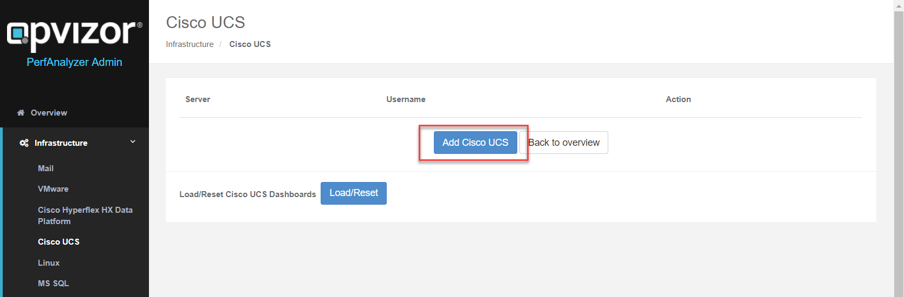
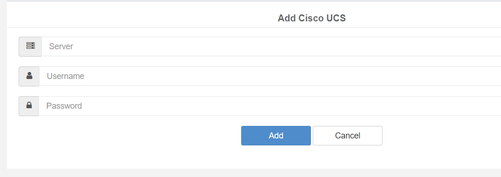

# Integration Cisco UCS

The integration of Cisco UCS is plain and simple, using our admin
interface:

**Make sure to use a local Cisco UCS management read only account**

There are 3 dashboards that come with our Cisco UCS Integration.

## Cisco UCS Environmental Stats

Starting with the environmental information about power consumption,
efficiency and fan speed, you get all information required to make sure
that everything is working fine from an temperature and power point of
view.

## Cisco UCS Network Port Channels

The network port channel dashboard gives you an overview of the
utilization of each port channel as well as the number of packet errors,
pause and loss. That gives you an instant view if packet errors
accumulate or packet loss starts.

## Cisco UCS Server Ports

Check all Backend- and Frontend port utilization, the jumbo package
traffic as well as occurring errors. That can be easily combined with
VMware ESXi information and metrics to get a full picture.

## Attachments:

[image-20190517-080414.png](attachments/900595713/900661258.png)
(image/png)  

[image-20190517-080442.png](attachments/900595713/900661267.png)
(image/png)  

[navigation.png](attachments/900595713/900595772.png) (image/png)  

[environmental.png](attachments/900595713/900661289.png) (image/png)  

[network\_port.png](attachments/900595713/900628489.png) (image/png)  

[ucs\_serverports.png](attachments/900595713/900595743.png)
(image/png)  

[navigation.png](attachments/900595713/900595725.png) (image/png)  

[ciscoucs\_pa491.png](attachments/900595713/900562972.png) (image/png)  

[environmental.png](attachments/900595713/900595731.png) (image/png)  

[network\_port.png](attachments/900595713/900595737.png) (image/png)  

