# Integration Kubernetes

# License

**Please contact <sales@opvizor.com> to receive information about**

  - Performance Analyzer Kubernetes Feature Pack. The extension is
    automatically available during the trial.

  - Multiple integrations are available through Helm charts

# Add your Kubernetes environment

To activate the Kubernetes Plugin, you need to add a Kubernetes license
for Performance Analyzer first.

Select Configuration Plugins

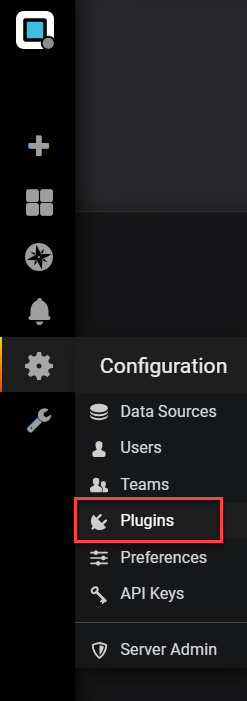

Select Kubernetes

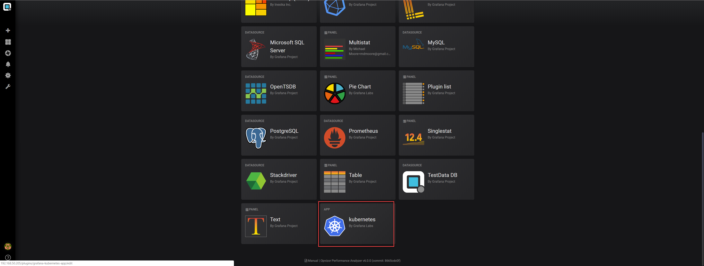

Enable Kubernetes App

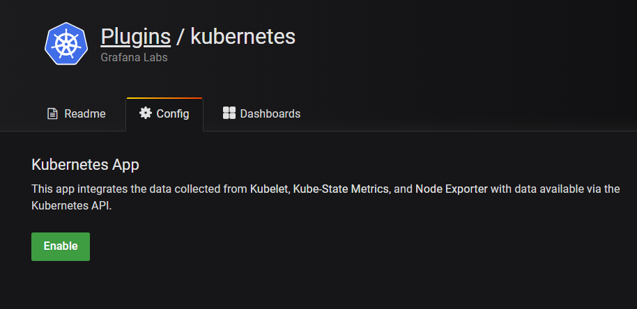

Add your Prometheus Server (that is running in your Kubernetes
environment):

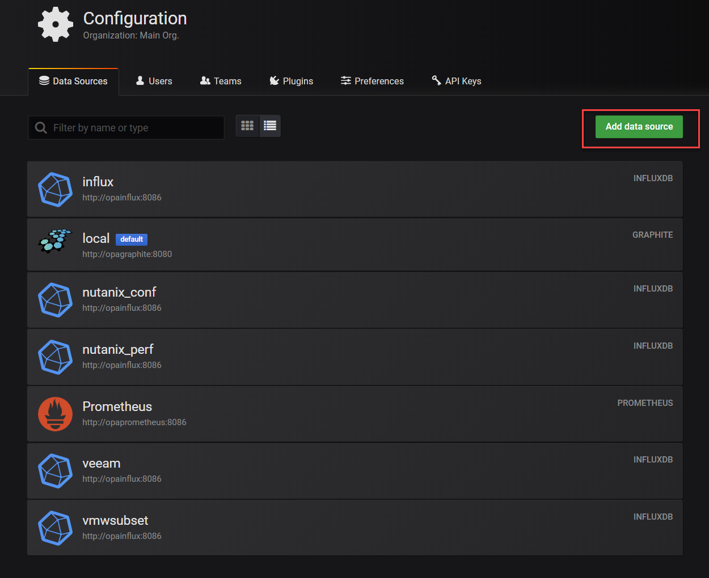

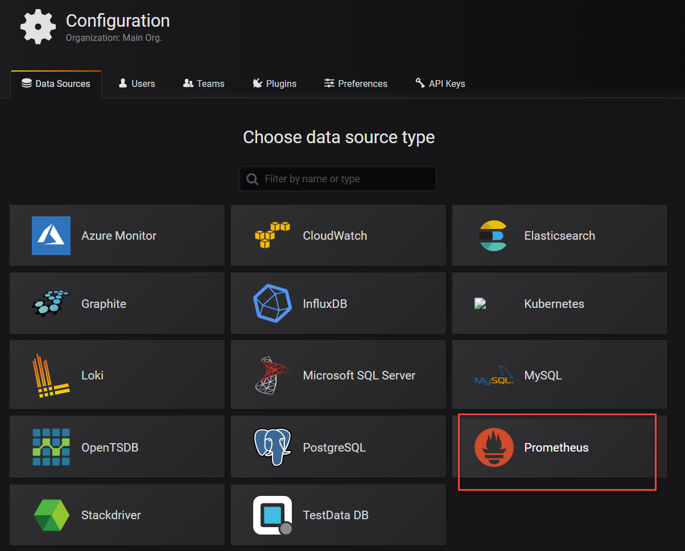

Please contact us if you have no Prometheus server running inside of
your Kubernetes environment.

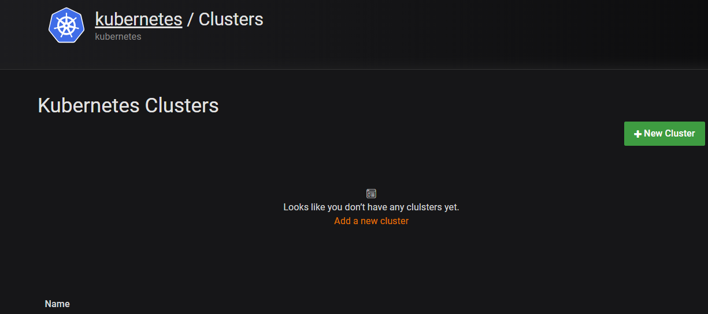

Add Kubernetes Cluster and configure the cluster as required and make
sure to click deploy instead of save.

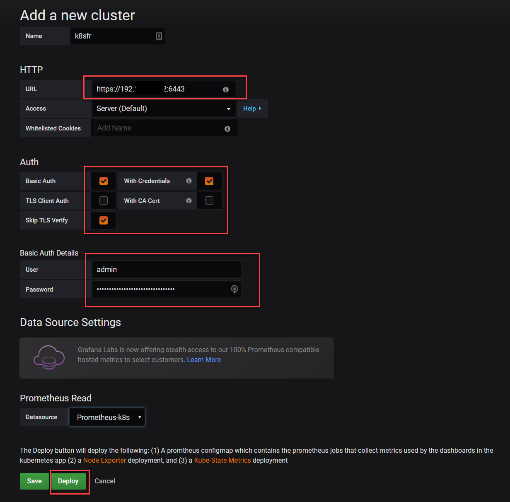

That’s it – if the Prometheus server is correct and the deployment
worked well you should see data within the Kubernetes dashboards after 5
minutes.

## Kubernetes dashboards

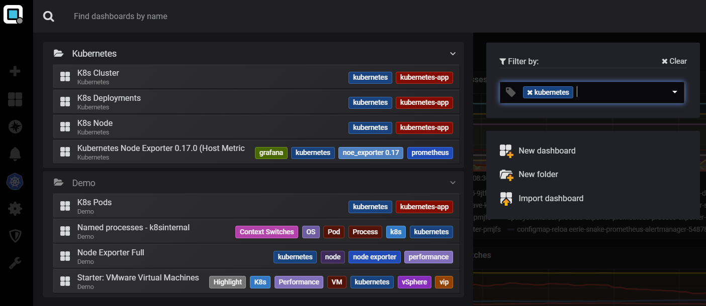

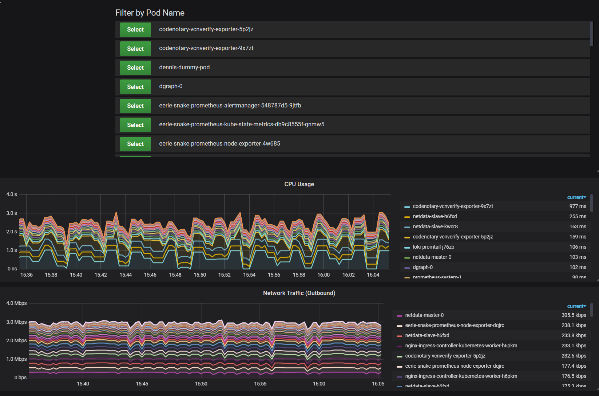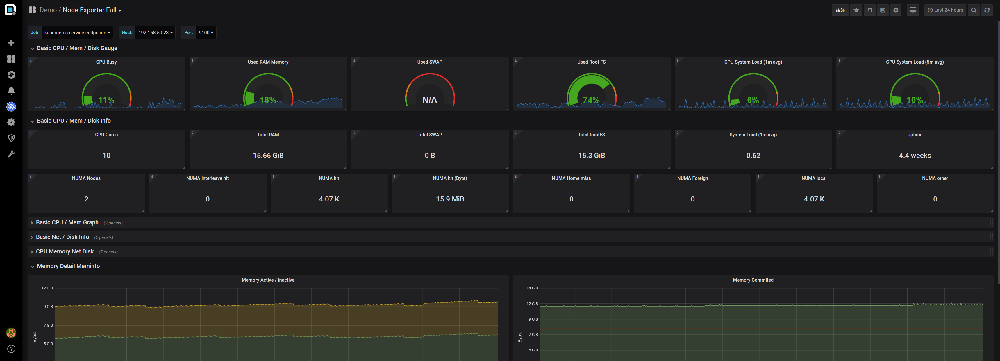

## VMware and Kubernetes

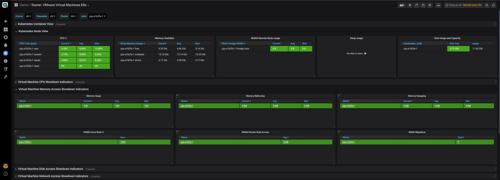

Please contact us to receive the dashboard for VMware/Kubernetes view.

## Pod process in Kubernetes

Please contact us to receive the Helm charts to integrate the Pod
process view as well.

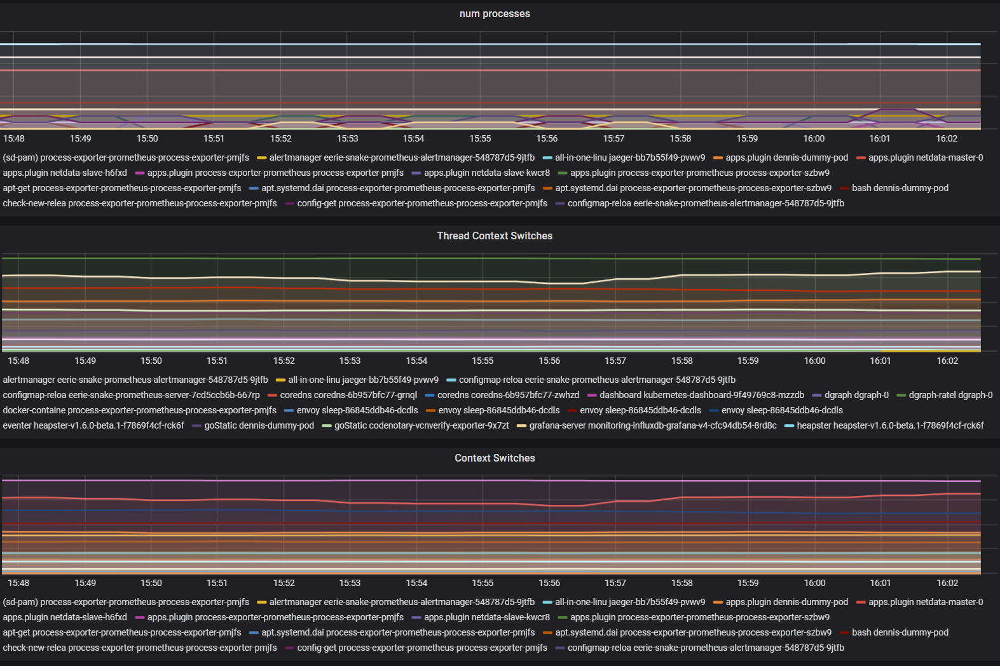

## Attachments:

[image-20190510-064442.png](attachments/899481601/899579908.png)
(image/png)  

[image-20190510-064459.png](attachments/899481601/899514376.png)
(image/png)  

[image-20190510-064516.png](attachments/899481601/899514384.png)
(image/png)  

[image-20190510-064958.png](attachments/899481601/899547141.png)
(image/png)  

[image-20190510-065011.png](attachments/899481601/899579919.png)
(image/png)  

[image-20190510-065050.png](attachments/899481601/899514400.png)
(image/png)  

[image-20190510-065126.png](attachments/899481601/899612677.png)
(image/png)  

[kubernetes-pod.png](attachments/899481601/899579929.png) (image/png)  

[k8scontainerproc.png](attachments/899481601/899612685.png)
(image/png)  

[k8snode\_numa.png](attachments/899481601/899481616.png) (image/png)  

[starter\_vmk8snuma.png](attachments/899481601/899612693.png)
(image/png)  

[image-20190510-065915.png](attachments/899481601/899547155.png)
(image/png)  

