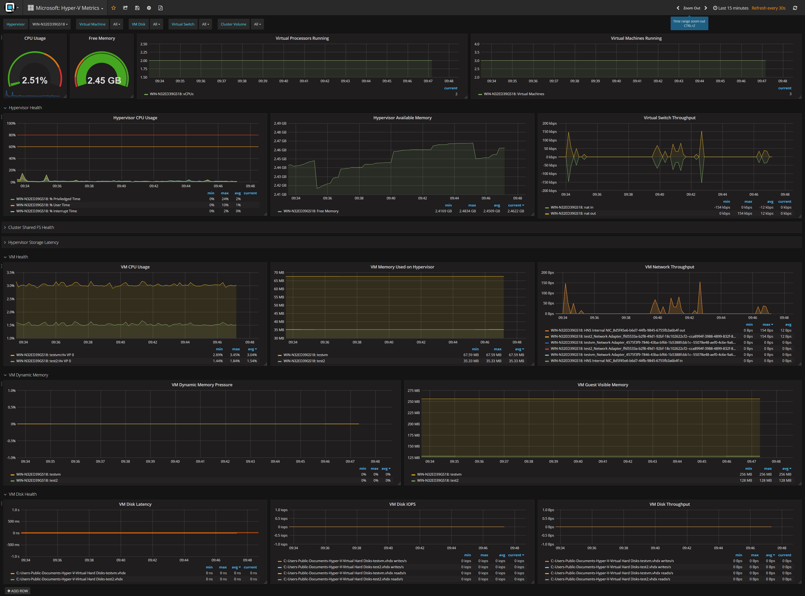

# Integration Microsoft Windows Hyper-V

There are 3 steps to follow after selecting Infrastructure / Windows in
your admin interface:

  
Download the telegraf archive from our admin page and follow the
installation instruction for telegraf (extract, install service, start)
and make sure to overwrite the telegraf.conf as described in the text
below. 

  - Extract telegraf to %programfiles%/telegraf
  - Overwrite the telegraf.conf on the Hyper-V host with the following
    file and change the following line urls = \["http://\<\>:8086"\] to
    reflect the Performance Analyzer IP or dns name → [Hyper-V
    telegraf.conf download](attachments/805666817/805830657.conf)
  - Open an administrative PowerShell session and type **telegraf
    --service install** to install the Windows service and **net start
    telegraf**

Then import the Microsoft Hyper-V dashboard - [Download Dashboard
here](attachments/805666817/805732358.json)   

  
That's it

## Attachments:

[netapp-dashboards.png](attachments/805666817/805666820.png)
(image/png)  

[netapp-add.png](attachments/805666817/805666823.png) (image/png)  

[veeam\_patch.png](attachments/805666817/805666826.png) (image/png)  

[veeam\_admin.png](attachments/805666817/805666829.png) (image/png)  

[veeam\_dashboard.png](attachments/805666817/805666832.png)
(image/png)  

[veeam\_admin2.png](attachments/805666817/805666835.png) (image/png)  

[telegraf-hyperv-new.conf](attachments/805666817/805830657.conf)
(application/octet-stream)  

[image2018-9-27\_9-47-12.png](attachments/805666817/805863429.png)
(image/png)  
 [Microsoft\_ Hyper-V
Metrics-1538034052245.json](attachments/805666817/805732358.json)
(application/json)  

[hyper-v-dashboard.png](attachments/805666817/805699587.png)
(image/png)  

[image2018-9-27\_9-51-43.png](attachments/805666817/805797892.png)
(image/png)  

