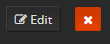

# Playlists

A playlist rotates through a pre-selected list of Dashboards. A Playlist
is a great way to build situational awareness, or show your metrics to
your team or visitors.

The following dashboards a good mix in my case as I want to see the
common vital signs of my hosts and vms as well as the application
itself:

  - Highlights: Virtual Machines  
    

<!-- end list -->

  - VMware vSphere Health Status
  - VMware Performance: VM Cluster
  - SQL Server Monitoring  
    

To create a playlist:

1.  Click the **opvizer icon \> Dashboards \> Playlist**.  
    The playlists dialog appears.  
    **  
    **

2.  Click the green **+ New Playlist** button.  
    The **New Playlist** dialog appears.  
    

3.  In the **Name** field, add a name

4.  In the **Interval** field, change the interval if desired. The
    default is 5 minutes (5m). Use s for seconds, m for minutes, h for
    hours. No space between the number and unit).

5.  Add a dashboard by click the **+Add to playlist** button to the
    right of each dashboard name.

6.  Repeat for as many as you want.

7.  Scroll to the bottom of the dialog and click the green **Create New
    Playlist** button.  
    The **Saved Playlist** screen appears.  
    

8.  Click **\> Play** to play the playlist.

9.  After saving the playlist, you can either use the **Start url** or
    the **Play **button to start the rotation through the selected
    dashboards. Don’t forget to bookmark the link\!
    
      
    While the playlist is active, you can see the control buttons next
    to the dashboard name. Go Back, Skip the current dashboard or pause
    the dashboard
rotation.

## Video – how to create a daily routing playlist using Performance Analyzer

[Opvizor Performance Analyzer – Use Playlists to optimize your daily
routine](https://vimeo.com/221810085) from [opvizor](https://vimeo.com/opvizor) on [Vimeo](https://vimeo.com/).

You can also edit or delete the playlist by clicking the buttons
on the right of the screen.

## Attachments:

[image2017-7-1\_23-57-41.png](attachments/84037334/84037784.png)
(image/png)  

[image2017-7-1\_23-59-16.png](attachments/84037334/84037814.png)
(image/png)  

[image2017-7-2\_0-5-44.png](attachments/84037334/84037934.png)
(image/png)  

[image2017-7-2\_0-7-15.png](attachments/84037334/84037971.png)
(image/png)  

