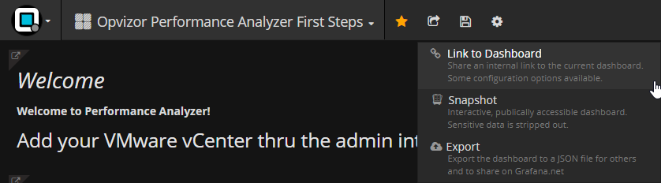

# Share a Dashboard Link

You can share a link to a dashboard with colleagues. You can configure
the sharing by specifying a data range, template variables or theme.

1.  Click the **Link** button in the top menu.and select **Link to
    Dashboard**.  
      
    The **Share \> Link** dialog opens.  
    
2.  Optionally, configure a time range, template variable or theme.
3.  Click the **Copy** button to copy it to your clipboard.

  

