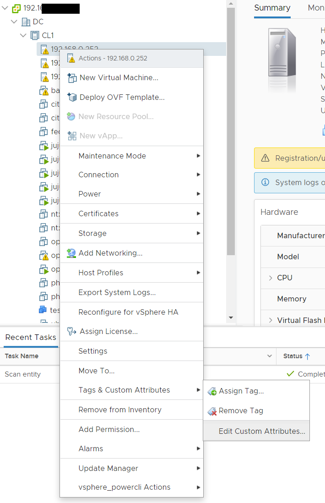
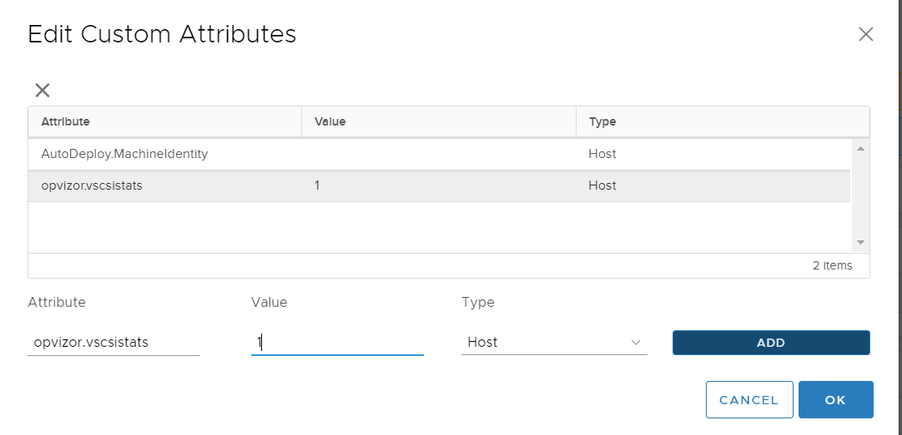

# vscsiStats

vscsiStats is a tool running on the ESXi host. It allows in depth
analysis of VM, host and datastores, with data not available in vCenter.

Since vscsiStats consumes some host resources itself, it is not
recommended to have it running all the time. But it is very helpful, if
you have to troubleshoot storage performance.

Opvizor created an on demand invocation for vscsiStats. Just add a
custom attribute "opvizor.vscsistats" to the host(s) you want to
monitor, and set it to 1 to start data collection. Set it to 0 to stop
data collection.

  

  

The dashboard uses incremental rendering. To view best, click the
Refresh-Icon in the upper left corner once the dashboard is loaded.

